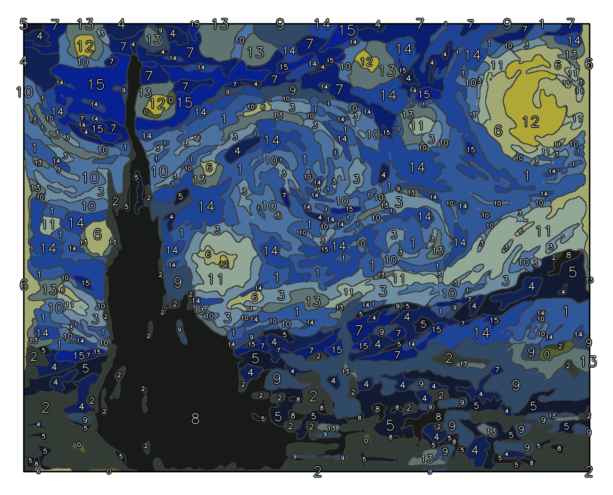
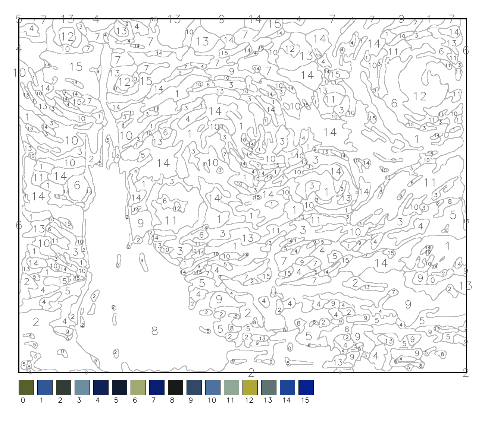
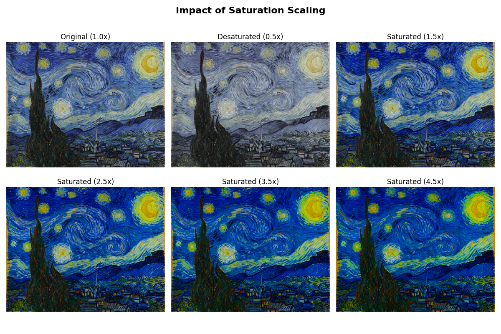
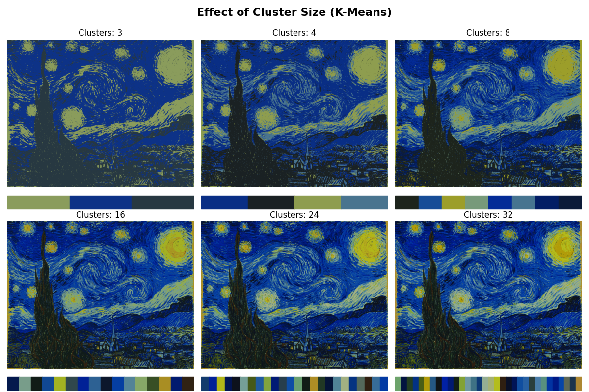
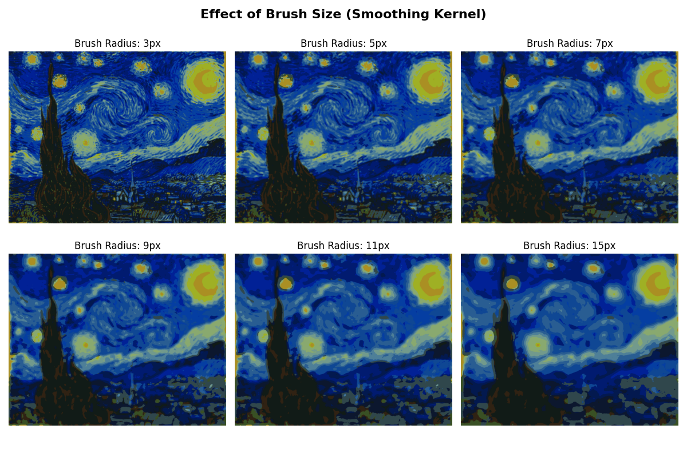
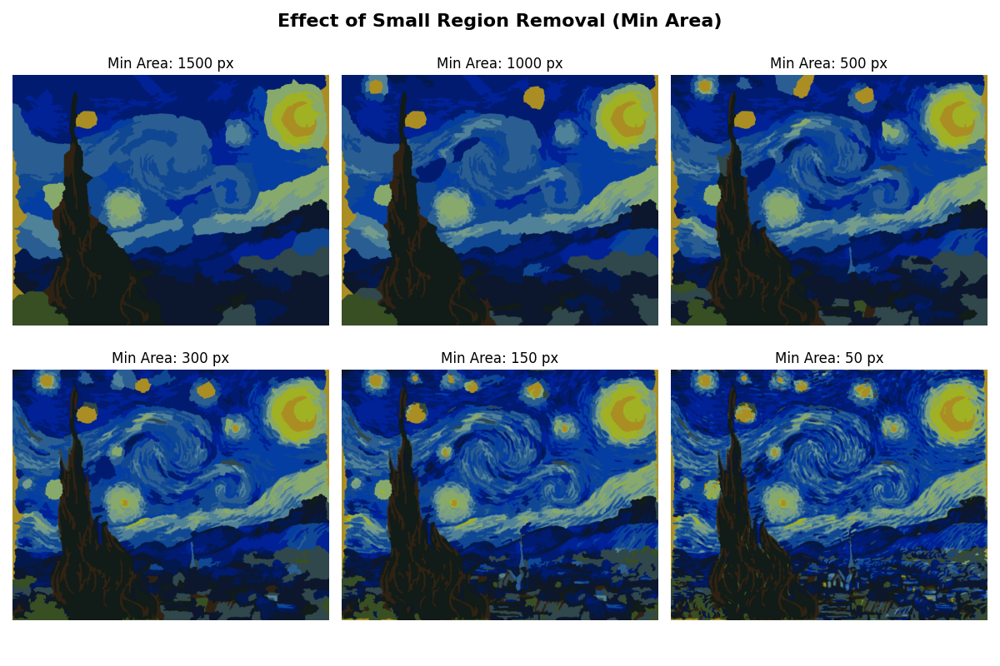
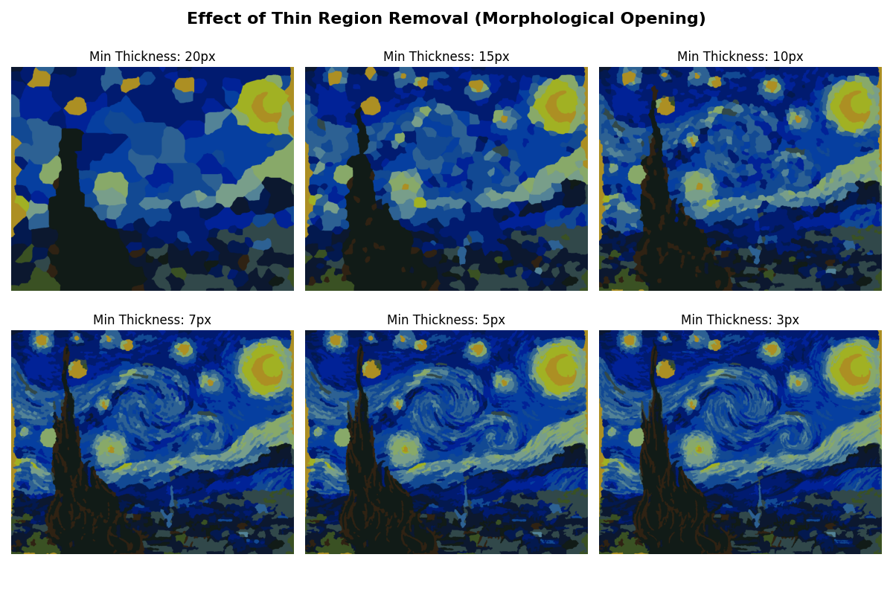
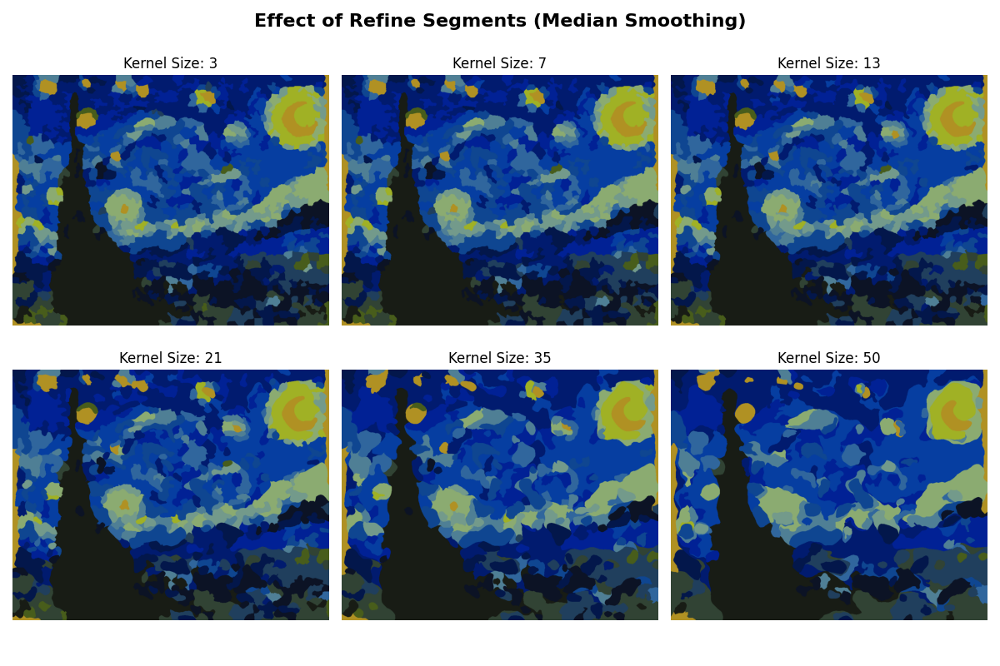

# Paint By Number Generator 🎨


A robust Python tool that converts any image into a high-quality "Paint by Number" template. It uses K-Means clustering, morphological processing, and automated labeling to generate printable canvases and colored reference guides.



*Effect Preview*



*Printable Canvas Preview*

## Features

* **Smart Palette Reduction:** Uses K-Means clustering in Lab color space to pick the most representative colors.
* **Noise Removal:** multiple filtering stages to remove "pixel dust" and tiny, unpaintable regions.
* **Organic Smoothing:** Morphological operations ensure shapes have smooth, natural curves rather than jagged pixel edges.
* **Smart Labeling:** Automatically calculates the optimal position and font size for numbers, ensuring readability even in small regions.
* **Print-Ready Output:** Generates two images:
    * **Canvas:** White background with light gray lines and dark gray numbers (optimized for printing).
    * **Preview:** Colored reference with high-contrast labels.

## Installation

**Prerequisites:**
* Python 3.14 or higher
* pip

1.  Clone the repository:
    ```bash
    git clone [https://github.com/lmachado-sousa/paint-by-numbers.git](https://github.com/lmachado-sousa/paint-by-numbers.git)
    cd paint-by-numbers
    ```

2.  Install dependencies:
    ```bash
    pip install -r requirements.txt
    ```

## Usage

You can import the class into your own scripts or run the example pipeline:

```python
from paint_by_numbers import PaintByNumbers

# Initialize
pbn = PaintByNumbers("images/your_image.jpg")

# Run the Pipeline
(
    pbn.reset()
    .saturate(scale_factor=2.5)           # Boost color separation
    .set_palette(n_clusters=16)           # Reduce to 16 colors
    .recolor_with_palette()               # Apply palette
    .apply_brush(radius=3)                # Smooth "pixel noise"
    .remove_small_regions(min_area=250)   # Kill tiny specks
    .remove_thin_regions(min_thickness=3) # Kill impossible-to-paint lines
    .refine_segments(kernel_size=9, min_area=250) # Final smoothing polish
    .draw_shared_borders(smoothing_size=11, padding=50) # Draw lines
    .generate_labels(min_font_scale=0.4)  # Add numbers
    .display_results()                    # Show output
)
````

## Visual Examples

### Saturation Effect


*Comparing different saturation levels to enhance color separation*

### Clustering (Number of Colors)


*Effect of different color palette sizes (8, 16, 24, 32 colors)*

### Brush Filter


*Different brush radii for smoothing pixel noise*

### Remove Small Regions


*Impact of minimum area threshold on region cleanup*

### Remove Thin Regions


*Removing unpaintable thin lines and structures*

### Segment Refinement


*Final smoothing with different kernel sizes*

## How It Works

1.  **Saturation:** Boosts colors to help the clustering algorithm distinguish between similar shades.
2.  **Clustering:** Reduces the millions of colors in a photo down to a fixed palette (e.g., 16 colors).
3.  **Cleanup:**
      * *Small Regions:* Merges tiny islands into their largest neighbor.
      * *Thin Regions:* Removes spider-web lines that are too thin to paint.
4.  **Refinement:** Applies a median blur to the segment map, creating the "smooth" look characteristic of paint-by-number kits.
5.  **Vector-like Lines:** Uses morphological gradients to draw shared borders, preventing gaps or double lines between colors.

## API Reference

### Core Methods

| Method | Parameters | Description |
|--------|------------|-------------|
| `resize(factor)` | `factor` (float): Division factor for dimensions | Resize image. factor > 1 reduces size |
| `saturate(scale_factor)` | `scale_factor` (float, default=2.5) | Increase color saturation |
| `set_palette(n_clusters)` | `n_clusters` (int, default=16) | Generate color palette via K-Means |
| `recolor_with_palette()` | None | Map all pixels to nearest palette color |
| `apply_brush(radius)` | `radius` (int, optional) | Apply smoothing filter |
| `remove_small_regions(min_area)` | `min_area` (int, default=500) | Remove regions smaller than threshold |
| `remove_thin_regions(min_thickness)` | `min_thickness` (int, default=3) | Remove thin structures |
| `refine_segments(kernel_size, min_area)` | `kernel_size` (int, default=7)<br>`min_area` (int, default=500) | Smooth boundaries and cleanup |
| `draw_shared_borders(...)` | `line_thickness` (int, default=1)<br>`smoothing_size` (int, default=3)<br>`padding` (int, default=50) | Generate bordered output images |
| `generate_labels(...)` | `min_font_scale` (float, default=0.4)<br>`max_font_scale` (float, default=1.0) | Add numbered labels to regions |
| `display_results(figsize)` | `figsize` (tuple, default=(16,8)) | Display canvas and preview |
| `save_output(prefix)` | `prefix` (str, default="output") | Save images as PNG files |

### Method Chaining

All transformation methods return `self`, enabling fluent method chaining:

```python
pbn.resize(2).saturate().set_palette(20).recolor_with_palette().save_output("my_art")
```

## Tips for Best Results

* **Image Size:** Start with images around 800-1200px on the longest side. Use `resize()` to scale down larger images.
* **Color Count:** 12-20 colors works well for most images. Too few creates oversimplified results; too many makes painting tedious.
* **Saturation:** Higher values (2.5-3.0) help separate similar colors, especially in photos with muted tones.
* **Region Cleanup:** Adjust `min_area` based on your intended print size. Smaller prints need larger min_area values.
* **Smoothing:** Larger kernel sizes in `refine_segments()` create more organic, paint-like shapes.

## License

This project is licensed under the GNU GPLv3 License - see the `LICENSE` file for details.